#  Introduction to KNATIVE

Application Integration via Knative Serving and Eventing


---

# By sebgoa

By Sebastien Goasguen, author of the Docker Cookbook and co-author of Kubernetes cookbook. Co-founder of TriggerMesh

**@sebgoa** 

**@triggermesh** [https://github.com/triggermesh](https://github.com/triggermesh)

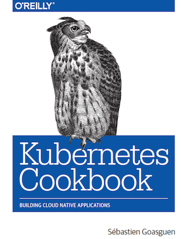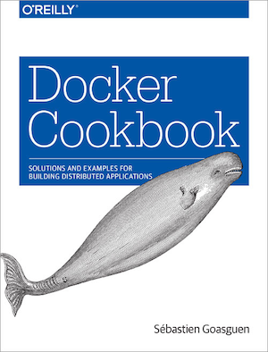

---

# Pre-requisities

* `kubectl` , [https://kubernetes.io/docs/user-guide/prereqs/](https://kubernetes.io/docs/user-guide/prereqs/)
* Sign-in to [https://cloud.triggermesh.io](https://cloud.triggermesh.io)
* A fresh Kubernetes cluster

---

# TriggerMesh Cloud 

## [https://cloud.triggermesh.io](https://cloud.triggermesh.io)

* **Runs Knative so you don't have to**
* Exposes some of the Kubernetes API
* Free + gain time

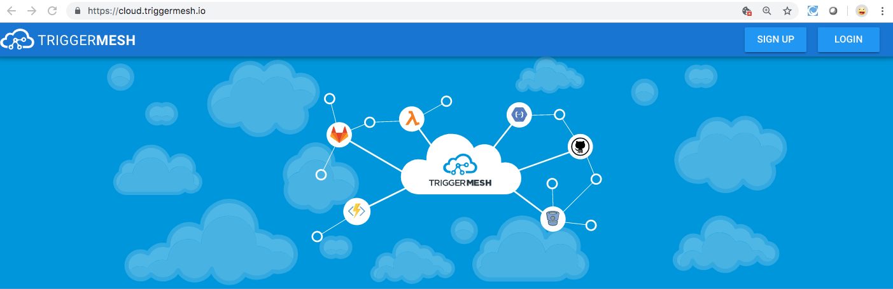

---

## Agenda


### Part I
* Serverless Intro
* Knative Installation

### Part II
* Knative Serving

### Part III
* Knative Eventing
* Integration with Kafka

We break for 5 to 10 minutes twice !

---

# IT Landscape

We are being bombarded with new tech every day.

Our landscapes of tools and solutions is increasingly hard to understand

**EASY TO DISMISS NEW TECH AND BE JADED**

---

# CNCF Landscape

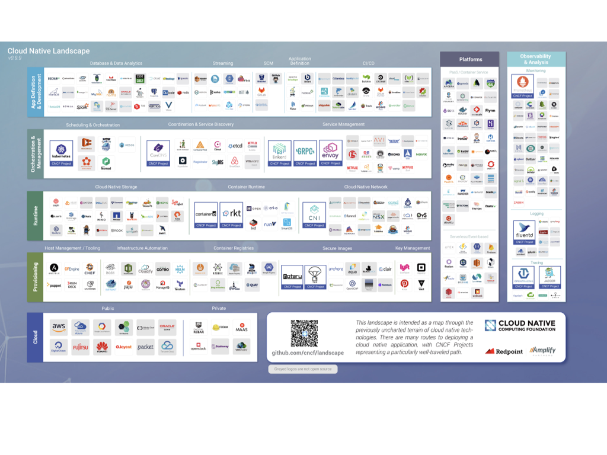

---

# How do you Choose and Keep up

* Software does not come out of thin air (i.e foundation)
* Evaluate technology and historical context
* Do not dismiss new paradigm

Kubernetes example !


---

# Serverless

**IT MAKES SENSE**

* Less worry about infrastructure
* Less code
* Less wait
* More resilience
* More security
* More scalability
* More applications

---

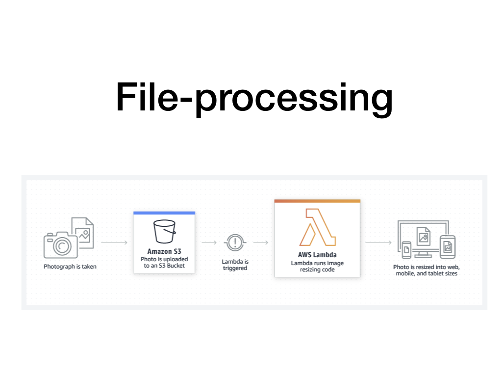

---
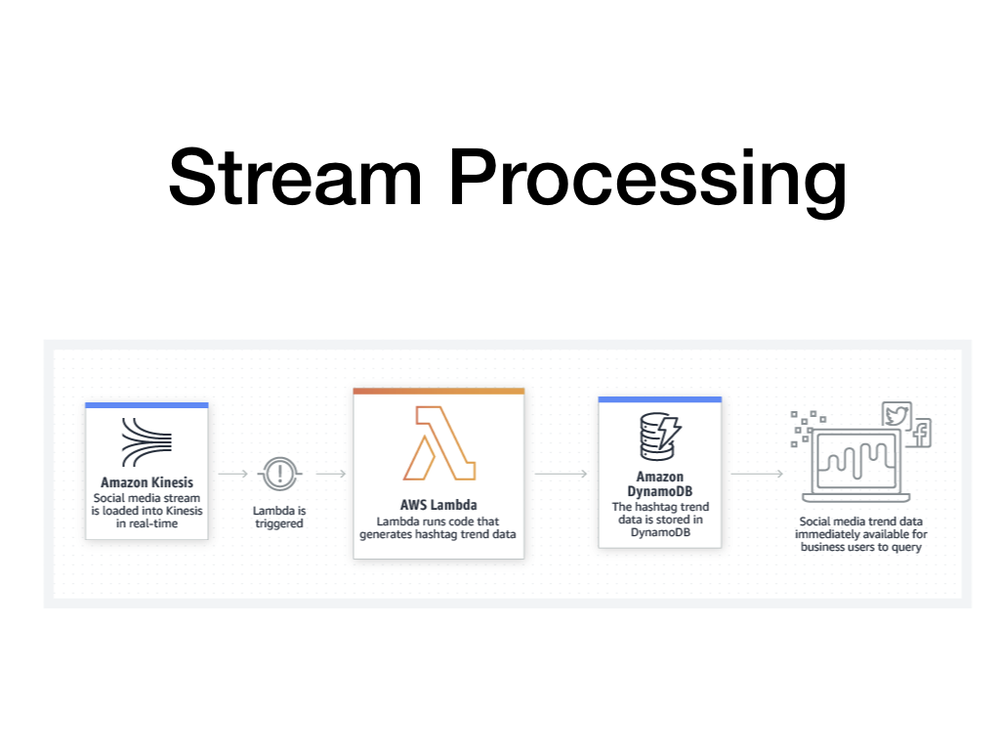

---
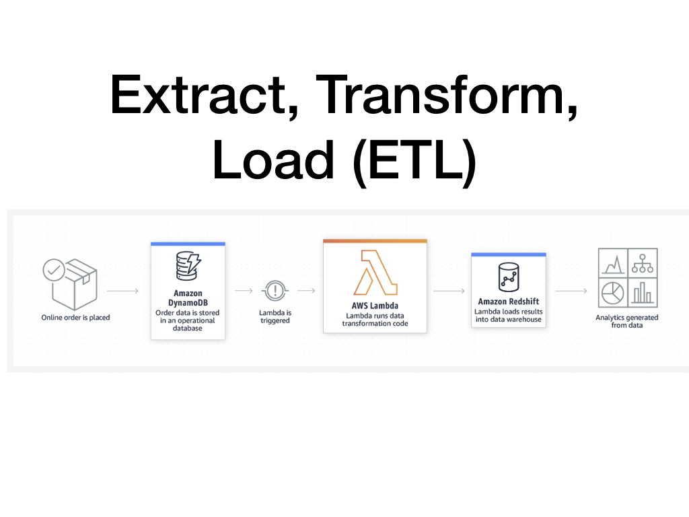

---
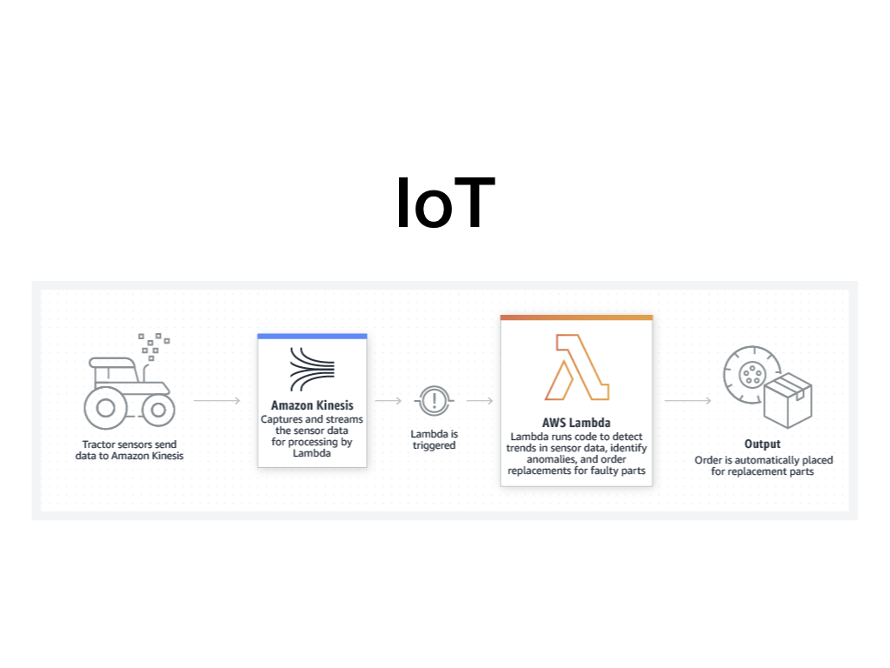

---

# Observations

* AWS is the leader
* "Simple" Pipeline but that can scale
* Serverless but also **ServiceFull**

---

# Challenge

How can you build these applications:

* On your own or just using the services
* Without Lockin
* Using services that may only be available on-prem
* But with limited operational cost while having scale and resilience


---

# DEMOS

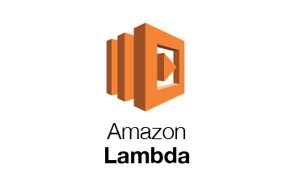 

* AWS Lambda 		
* CloudRun 			

---

# TGIK style ...

If you have an account on Google cloud you can try it on your own, if not please follow the live demo (creating an account on GCP is not mandatory)

* Log In to [Google Cloud](https://cloud.google.com/)
* Launch a Hello example on [Cloud Run](https://console.cloud.google.com/run)
* Get its file manifest using `gcloud`

---

# Cloud run interface


* Click on `Create Service`
* Use the `gcr.io/cloudrun/hello` container image
* Make sure to select `Allow Unauthenticated Invocations`

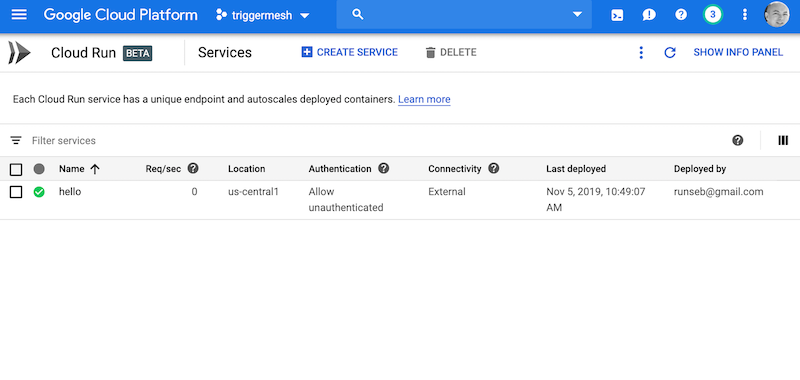

---

#  CloudRun

```
gcloud beta run services list
gcloud beta run services describe \
                         hello \
                         --region us-central1 \
                         --format yaml > hello.yaml
```

---

# Let's clean the manifest


* Remove the `status` section
* Remove the `serviceaccount`
* Remove the `namespace`
* Just keep the `name` in the metadata

---

# Deploy to TriggerMesh

Two methods:

```
kubectl -n <your_id> apply -f foo.yaml
```

Or:

Copy Paste by Creating a Service using the Icon.

---

# Go !


---

# Extending Kubernetes

What if you need additional objects ...

---
## Custom Resource Definitions.

Kubernetes lets you add your own API objects. Kubernetes can create a new custom API endpoint and provide CRUD operations as well as watch method.

This is great to extend the k8s API server with your own API.

Check the Custom Resource Definition [documentation](https://kubernetes.io/docs/tasks/access-kubernetes-api/extend-api-custom-resource-definitions/)

---
## CRD Example

```
apiVersion: apiextensions.k8s.io/v1beta1
kind: CustomResourceDefinition
metadata:
  name: databases.foo.bar
spec:
  group: foo.bar
  version: v1
  scope: Namespaced
  names:
    plural: databases
    singular: database
    kind: DataBase
    shortNames:
    - db
```

Let's create this new resource and check that it was indeed created.

```
$ kubectl create -f database.yml
$ kubectl get customresourcedefinition
NAME                        KIND
databases.foo.bar           CustomResourceDefinition.v1beta1.apiextensions.k8s.io
```

---
## Custom Resources

You are now free to create a _customresource_. 

```
$ cat db.yml
apiVersion: foo.bar/v1 
kind: DataBase
metadata:
  name: my-new-db 
spec:
  type: mysql
$ kubectl create -f foobar.yml
```

And dynamically `kubectl` is now aware of the _customresource_ you created. 

```
$ kubectl get databases
NAME        KIND
my-new-db   DataBase.v1.foo.bar
```
---

## Operator Framework(s)

* Kubebuilder: [https://github.com/kubernetes-sigs/kubebuilder](https://github.com/kubernetes-sigs/kubebuilder)
* Operator Framework: [https://github.com/operator-framework/operator-sdk](https://github.com/operator-framework/operator-sdk)
* Metaontroller: [https://github.com/GoogleCloudPlatform/metacontroller](https://github.com/GoogleCloudPlatform/metacontroller)

... Write your own

---

# Knative CRDs

Knative components are a set of Kubernetes controllers. There are Knative CRDs and associated controllers

```
$ kubectl get crd | grep knative
# kubectl get crd | grep knative
images.caching.internal.knative.dev                  2020-02-10T14:27:05Z
certificates.networking.internal.knative.dev         2020-02-10T14:27:06Z
configurations.serving.knative.dev                   2020-02-10T14:27:06Z
ingresses.networking.internal.knative.dev            2020-02-10T14:27:06Z
metrics.autoscaling.internal.knative.dev             2020-02-10T14:27:06Z
podautoscalers.autoscaling.internal.knative.dev      2020-02-10T14:27:06Z
revisions.serving.knative.dev                        2020-02-10T14:27:06Z
routes.serving.knative.dev                           2020-02-10T14:27:06Z
...
```

---

# Knative Installation

At a high level we will:

* Create some CRDs
* Create some namespaces
* Launch controllers in those namespaces

Then we will be able to create the Knative API objects.

```
$ kubectl get ns | grep knative
knative-eventing      Active    160d
knative-monitoring    Active    160d
knative-serving       Active    160d
knative-sources       Active    160d
```
---

# Provider Agnostic Installation

[https://knative.dev/docs/install/knative-with-any-k8s/](https://knative.dev/docs/install/knative-with-any-k8s/)

Install the Knative CRDs:

```
kubectl apply --filename https://github.com/knative/serving/\
                         releases/download/v0.12.0/serving-crds.yaml
```

Then the Knative controllers:

```
kubectl apply --filename https://github.com/knative/serving/\
                         releases/download/v0.12.0/serving-core.yaml
```

---

# Need an Ingress Gateway

* Istio
* Ambassador
* Solo
* Contour
...


```
kubectl apply --filename https://raw.githubusercontent.com/knative/\
             serving/v0.12.0/third_party/contour-latest/contour.yaml

```

See [https://knative.dev/docs/install/knative-with-contour/](https://knative.dev/docs/install/knative-with-contour/)

---

# Live Screencast


Knative Installation

---

# BREAK TIME


---

# Part II

* Serving

---

# Knative Serving

> Knative Serving builds on Kubernetes to support deploying and serving of serverless applications and functions.

```
$ kubectl get pods -n knative-serving
NAME                                          READY   STATUS    RESTARTS   AGE
webhook-9cd7878cd-nbwkc                       1/1     Running   0          93m
controller-6569b6687d-btzhs                   1/1     Running   0          93m
autoscaler-77dd48cfdf-5fw49                   1/1     Running   0          93m
activator-67889464d8-zqskq                    1/1     Running   0          93m
contour-ingress-controller-6588cf5fdd-zrxvz   1/1     Running   0          91m
```

Under the hood still a Deployment and a Pod ...

---

# Knative Serving API Objects

* **Service**: The `service.serving.knative.dev` resource automatically manages the whole lifecycle of your workload.
* **Route**: The `route.serving.knative.dev` resource maps a network endpoint to a one or more revisions.
* **Configuration**: The `configuration.serving.knative.dev` resource maintains the desired state for your deployment.
* **Revision**: The `revision.serving.knative.dev` resource is a point-in-time snapshot of the code and configuration for each modification made to the workload.

---

# Knative Serving Objects Diagram


---

# Serving Specification

```
apiVersion: serving.knative.dev/v1alpha1
kind: Service
metadata:
  name: helloworld-go 
spec:
  template:
    spec:
      containers:
        - image: gcr.io/knative-samples/helloworld-go 
          env:
            - name: TARGET
              value: "Go Sample v1"
```

`kubectl apply -f hello.yaml` or paste it in the TriggerMesh UI


---

# Traffic Splitting

See [Blue/Green with Knative sample](https://knative.dev/docs/serving/samples/blue-green-deployment/)

Route can split traffic between Revisions:

```
apiVersion: serving.knative.dev/v1alpha1
kind: Route
metadata:
  name: blue-green-demo # Updating our existing route
spec:
  traffic:
    - revisionName: blue-green-demo-00001
      percent: 50 # Updating the percentage from 100 to 50
    - revisionName: blue-green-demo-00002
      percent: 50 # Updating the percentage from 0 to 50
      name: v2
```

Let's try it ?

---

# Traffic Splitting Sample

* Create the Service object with the UI (paste the yaml and remove the namespace)

```
apiVersion: serving.knative.dev/v1alpha1
kind: Service
metadata:
  name: demo
spec:
  template:
    metadata:
      name: demo-blue
    spec:
      containers:
        - image: gcr.io/knative-samples/knative-route-demo:blue
          env:
            - name: T_VERSION
              value: "blue"
  traffic:
  - tag: current
    revisionName: demo-blue
    percent: 100
```

---

# Update the YAML via the UI

Switch to **green**

```
apiVersion: serving.knative.dev/v1alpha1
kind: Service
metadata:
  name: demo
spec:
  template:
    metadata:
      name: demo-green
    spec:
      containers:
        - image: gcr.io/knative-samples/knative-route-demo:green
          env:
            - name: T_VERSION
              value: "green"
  traffic:
  - tag: green
    revisionName: demo-green
    percent: 50
  - tag: blue
    revisionName: demo-blue
    percent: 50
```

---

# Traffic Splitting

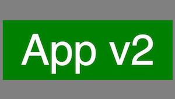

---

# Building Containers

But but...

I thought Serverless had nothing to do with Containers, can't I just run my code ?

Sure but it will need to run somewhere and be packaged. Containers are a great packaging artefcats. If you give me your code, I still need to package it, aka. Build.

**Hence we need a way to create Containers within a Kubernetes cluster**

Originally `Pipeline` project within the Knative github organization. Donated to CNCF at [creation of the CDF foundation](https://www.linuxfoundation.org/press-release/2019/03/the-linux-foundation-announces-new-foundation-to-support-continuous-delivery-collaboration/).

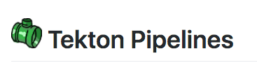

---

# BREAK TIME


---

# Part III

## Knative Eventing

> Knative Eventing is a system that is designed to address a common need for cloud native development and provides composable primitives to enable late-binding event sources and event consumers.

Consume events from _Sources_, use those events to _Trigger_ execution of _functions_.

---

# Knative eventing Objects

``v1.0` is coming SOOOONNNN !

* Broker
* Trigger
* Channel
* Subscription

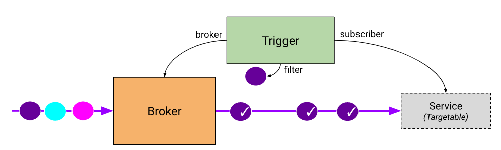

---

# Knative Eventing

When running properly, check the `knative-eventing` namespace

```
kubectl get pods -n knative-eventing
NAME                                   READY   STATUS    RESTARTS   AGE
sources-controller-6bf9f6d958-h9996    1/1     Running   0          15s
imc-controller-675dd47677-w9kjr        1/1     Running   0          15s
eventing-controller-6f4bbb779b-frslp   1/1     Running   0          15s
imc-dispatcher-6c9875f557-md4k2        1/1     Running   0          15s
eventing-webhook-9c697c59-z95xs        1/1     Running   0          15s
```

You may see other channel controllers (e.g Kafka, NATS, GCP PubSub ...)

---

# Knative Eventing Objects

Sources, Channels, Triggers, Brokers ...

```
apiVersion: sources.eventing.knative.dev/v1alpha1
kind: CronJobSource
metadata:
  name: test-cronjob-source
spec:
  schedule: "*/2 * * * *"
  data: '{"message": "Hello world!"}'
  sink:
    apiVersion: serving.knative.dev/v1alpha1
    kind: Service
    name: event-display
```

---

# Demo Eventing

1. Run a `message-dumper` service
2. Run a `CronJob` source

Check the objects with `kubectl` or `tm`

See [https://github.com/knative/docs/tree/master/docs/eventing/samples/cronjob-source](https://github.com/knative/docs/tree/master/docs/eventing/samples/cronjob-source)

If time permits, let's do a [GitHub Source ...](https://github.com/knative/docs/tree/master/docs/eventing/samples/github-source)

---

# Writing your Own Knative Event Source

Check [ksources](https://github.com/sebgoa/ksources)

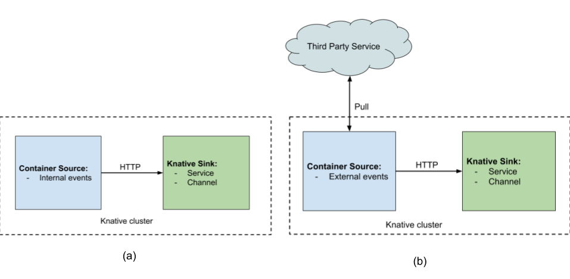

---

# Writing your Own Knative Event Source

Can be as simple as packaging a Bash script in a container:

```
apiVersion: sources.eventing.knative.dev/v1alpha1
kind: ContainerSource
metadata:
  name: bashsample
spec:
  image: gcr.io/triggermesh/bash
  sink:
    apiVersion: eventing.knative.dev/v1alpha1
    kind: Channel
    name: default
```

---

# Wrap-Up

* Knative is an extension of the Kubernetes API
* It provides APIs to build serverless workloads
* Serving gives you scale to zero
* Eventing allows you to trigger function when events happen

Serverless is more than FaaS, it blends Event Driven Architecture (EDA) with new containerized workloads.

---

# Thank You

**@sebgoa**

Feedback, contributions to TriggerMesh would be lovely !!!